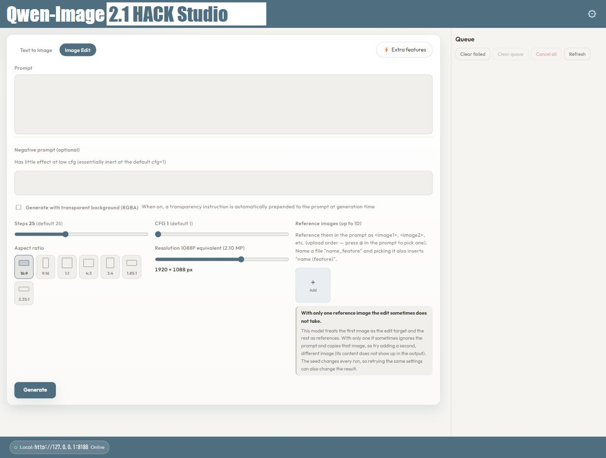
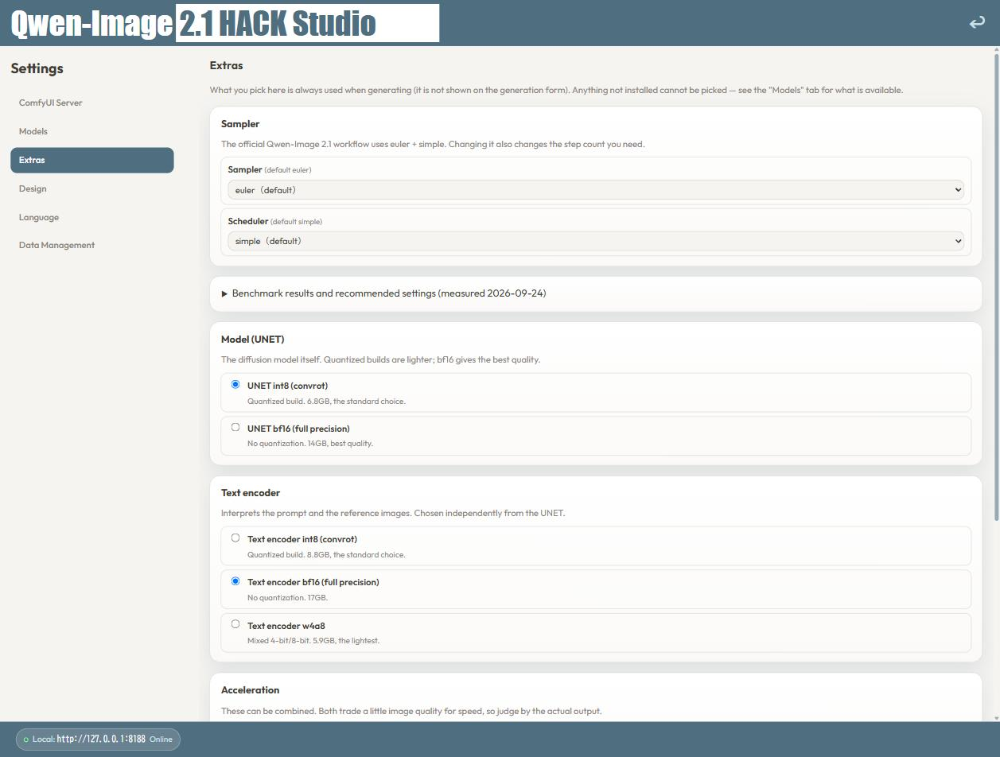
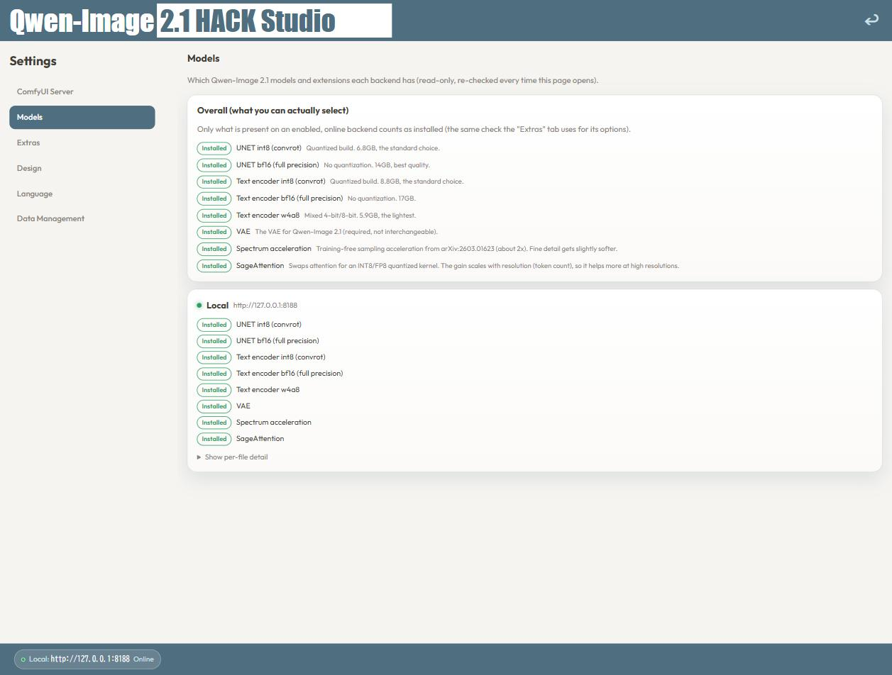

# Qwen-Image 2.1 HACK Studio

[English](README.md) | [日本語](README.ja.md) | **中文** | [한국어](README.ko.md) | [Deutsch](README.de.md) | [Español](README.es.md) | [Bahasa Indonesia](README.id.md)

### ⬇️ [下载安装程序（Windows）](https://github.com/cookinglifehack-png/Qwen-Image-2.1-HACK-Studio/releases/latest/download/Qwen-Image_2.1_HACK_Studio_Setup.exe)

一款 Windows 应用，安装后即可使用运行在 ComfyUI 上的图像生成模型 **Qwen-Image 2.1**。
无需编辑 ComfyUI 工作流，也不需要 PHP 知识——双击启动，只需通过类似浏览器的表单操作，
即可完成文生图和图像编辑。

> **非官方工具。** 本应用由独立第三方制作，与 Qwen 团队无关。**不包含模型**，
> 且模型不在本软件的许可范围内：Qwen-Image 2.1 以
> **Qwen Research License（仅限非商业用途；商业使用需另行向许可方取得授权）** 发布。
> 请务必自行阅读模型的使用条款。

## 安装准备（ComfyUI + Qwen-Image 2.1 模型）

安装程序只包含应用本身，**不包含** ComfyUI 和 Qwen-Image 2.1 模型权重。
请准备一个已安装模型的 ComfyUI，并在应用的设置界面中将其注册为后端。
请将下列文件放入 `ComfyUI/models/<文件夹>/`（文件名必须与应用期望的完全一致）。

### ComfyUI 本体

- 官方安装指南（Windows 便携版）：https://docs.comfy.org/installation/comfyui_portable_windows

### ① 最低配置（仅运行 Qwen-Image 2.1）

均来自官方仓库 [`Comfy-Org/Qwen-Image-2.1`](https://huggingface.co/Comfy-Org/Qwen-Image-2.1)。

| 用途 | 文件名 | 大小 | 目标文件夹 |
|---|---|---:|---|
| UNet（int8 量化） | `qwen_image_2.1_int8_convrot.safetensors` | 6.8GB | `models/diffusion_models/` |
| 文本编码器（int8 量化） | `qwen3vl_8b_int8_convrot.safetensors` | 8.8GB | `models/text_encoders/` |
| VAE | `qwen_image_2.1_vae_bf16.safetensors` | 645MB | `models/vae/` |

仅此即可运行文生图和图像编辑（基础配置，无加速）。

### ② 推荐（实测最快配置）

如下方基准测试所示，在 Full HD 下可**加速 2.1–2.2 倍**，画质仅有轻微差异。
请在①的基础上添加。

| 用途 | 来源 | 放置位置 / 步骤 |
|---|---|---|
| **Spectrum 加速节点** | https://github.com/awdqwdasdg/Comfyui-Spectrum-Qwen2.1 | clone 到 `custom_nodes/`（`SpectrumQwenImage21`），无额外依赖 |
| **SageAttention 节点** | https://github.com/kijai/ComfyUI-KJNodes | clone 到 `custom_nodes/`（`PathchSageAttentionKJ`） |
| **SageAttention 本体**（Windows wheel） | https://github.com/woct0rdho/SageAttention/releases | 先 `pip install triton-windows`，再安装与 PyTorch/CUDA 版本匹配的 wheel |
| 文本编码器 bf16（可选） | 同一官方仓库 | `qwen3vl_8b_bf16.safetensors`（17GB）→ `models/text_encoders/`。**速度与 int8 相同**，显存充裕时可选用 |

安装后请**重启 ComfyUI**，然后在本应用的 **设置 → 模型** 中查看安装状态。

### ③ 全部（其他量化版本）

| 用途 | 文件名 | 大小 | 用途说明 |
|---|---|---:|---|
| UNet bf16（全精度） | `qwen_image_2.1_bf16.safetensors` | 14GB | 不量化，画质优先 |
| 文本编码器 w4a8 | `qwen3vl_8b_w4a8.safetensors` | 5.9GB | 最轻量，适合显存紧张的环境 |

两者均在 `Comfy-Org/Qwen-Image-2.1` 中，放置位置与①②相同（`diffusion_models/` / `text_encoders/`）。

## 推荐设置

在 **设置 → 附加功能**，或生成界面右上角的“⚡ 附加功能”按钮中设置。

| 项目 | 推荐 | 原因 |
|---|---|---|
| **采样器** | `euler` + `simple` | Qwen-Image 2.1 官方工作流的默认值 |
| **UNET** | `int8 (convrot)` | 6.8GB，与 bf16 在实际使用中几乎无差别 |
| **文本编码器** | 显存充裕选 `bf16`，否则 `int8 (convrot)` | **速度几乎没有差别**——按显存而非速度选择 |
| **Spectrum** | **开启** | **约 2.0 倍**，效果最大；细节会稍微柔化 |
| **SageAttention** | **开启** | 再提升 5–10%，分辨率越高越明显 |

默认步数 25、CFG 1（仅在使用负面提示词时才提高 CFG）。

## 基准测试（实测）

条件：**1920×1088 / UNet `int8_convrot` 固定 / euler + simple / 25 steps / CFG 1 /
固定 seed / 文生图**，在本地 ComfyUI 后端上测量。

| 文本编码器 | 无 | Sage | **Spectrum** | **Sage + Spectrum** |
|---|---:|---:|---:|---:|
| **int8_convrot**（8.8GB） | 187.9s | 171.0s (1.10×) | 92.6s (2.03×) | **88.3s (2.13×)** |
| **bf16**（17GB） | 196.2s | 175.3s (1.12×) | 93.0s (2.11×) | **87.9s (2.23×)** |
| **w4a8**（5.9GB） | 191.7s | 176.0s (1.09×) | 96.9s (1.98×) | **90.7s (2.11×)** |

- 仅 Spectrum 就约 2 倍，对任何编码器倍率相同。Sage 再加 9–12%，可与之叠加。
- 文本编码器的选择对速度没有实质影响（在测量误差内）。
- 分辨率越高 Sage 越有效：2720×1536 时 1.17×，1920×1088 时 1.08×。

> **关于“Full HD”：** 指定 1920×1080 实际输出为 **1920×1088**，因为模型会把图像尺寸
> 向上取整为 16 的倍数。如需精确 1080p，请使用
> **设置 → 附加功能 → 输出与系统 → 生成后裁剪**，上下各裁掉 8px（提供 480/720/1080 预设）。

## 生成界面——一个无需猜测的布局

通过标签页在文生图和带参考图的编辑（Edit）之间切换。右侧队列会在任务完成时立即显示图像，
点击缩略图可打开全窗口／全屏查看器。尺寸和宽高比通过预设选择，并实时显示实际提交的分辨率。

## 附加功能——放心选择加速选项

采样器与调度器（标注默认值）、UNET／文本编码器版本、Spectrum 与 SageAttention——
每个选项的效果都在旁边说明，可折叠的基准报告会突出显示推荐组合。
这里还有适用于长时间任务的**防休眠**开关（会定期播放极小的声音以保持 Windows 唤醒）和**裁剪**选项。

## 模型标签页——一眼看清已安装内容

模型标签页会检查每个已连接的 ComfyUI 实际拥有哪些模型文件和自定义节点，缺少什么一目了然。

## 编辑模式提示

只提供**一张**参考图时，Qwen-Image 2.1 Edit 可能效果不稳定。应用会自动用一张中性灰色填充图
补足单张参考图，使其表现与两张图时一致。超过约 100 万像素的参考图会自动缩小（保持宽高比）。

## 适合谁

- 想只通过表单操作、不接触 ComfyUI 节点图就使用 Qwen-Image 2.1 的人
- 希望依据实测数据而非猜测来选择量化和加速选项的人
- 拥有多台 ComfyUI 机器/GPU，希望任务自动分配到最空闲一台的人

## 下载

Windows 安装程序（自包含，无需额外运行时）可在 Releases 中获取。

带截图的分步说明请参见 [USAGE.zh.md](USAGE.zh.md)。

## 反馈与提问

错误报告、功能建议或任何问题，请使用 [Issues](../../issues)。
