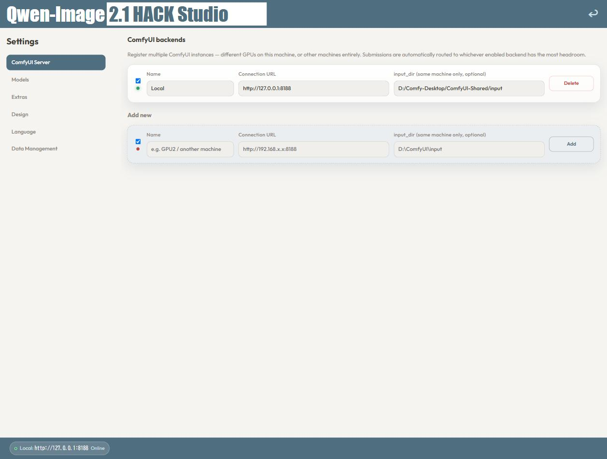

# Guía de uso

[English](USAGE.md) | [日本語](USAGE.ja.md) | [中文](USAGE.zh.md) | [한국어](USAGE.ko.md) | [Deutsch](USAGE.de.md) | **Español** | [Bahasa Indonesia](USAGE.id.md)

Un recorrido desde la instalación hasta tu primera imagen generada, con capturas de las pantallas reales.

## 1. Instalar

Ejecuta el instalador (`Qwen-Image_2.1_HACK_Studio_Setup.exe`), acepta el acuerdo de licencia e instala.
Al terminar, ábrelo desde el escritorio o el menú Inicio.

Tus datos (imágenes generadas, archivos subidos, historial de trabajos, ajustes) se guardan en
`%LOCALAPPDATA%\Qwen-Image 2.1 HACK Studio\` y **se conservan** al desinstalar o actualizar.

## 2. Registrar un backend de ComfyUI

En el primer arranque, ve a **Ajustes → Servidor ComfyUI** y registra una instancia de ComfyUI que ya tenga
instalados los modelos de Qwen-Image 2.1 (consulta el README).

- **Nombre**: cualquier etiqueta (p. ej. `Local`)
- **URL**: la dirección de ComfyUI (normalmente `http://127.0.0.1:8188` en la misma máquina)
- **input_dir** (opcional): rellénalo solo si ComfyUI está en la misma máquina; acelera un poco la subida de
  imágenes de referencia. Déjalo vacío para un ComfyUI en otra máquina

Puedes registrar varios backends (otras GPU de la misma máquina u otras máquinas): cada envío se dirige
automáticamente al que esté menos ocupado.

## 3. Comprobar los modelos

Abre **Ajustes → Modelos**. Cada archivo de modelo y nodo personalizado aparece en una lista, indicando si
cada backend lo tiene.

Lo que falta aparece marcado; instálalo en ComfyUI (consulta las tablas de instalación del README),
**reinicia ComfyUI** y vuelve a cargar esta pantalla.

## 4. (Opcional) Elegir opciones de aceleración en Extras

En **Ajustes → Extras** (o con el botón «⚡ Extras» de la pantalla de generación) puedes configurar el sampler,
la variante de UNET / codificador de texto, Spectrum, SageAttention, el recorte de salida y la prevención de
suspensión. No se muestran en el formulario de generación: lo que elijas aquí es lo que siempre se usa.

Los valores por defecto sirven para empezar. Para más velocidad, activa **Spectrum** y **SageAttention**: el
informe de benchmark plegable de esta pantalla muestra el efecto medido de cada combinación.

- **Recortar tras generar** corta la parte superior e inferior para llegar exactamente a 1080/720/480 px de alto
  (el modelo produce múltiplos de 16, p. ej. 1080 → 1088).
- **Prevención de suspensión** mantiene Windows despierto durante un trabajo reproduciendo periódicamente un
  sonido muy suave. Desactívala si el sonido te molesta.

## 5. Generar una imagen

De vuelta en la pantalla principal, elige una pestaña (texto a imagen o Edit) y escribe un prompt.

- **Tamaño / relación de aspecto**: elige entre los preajustes (el tamaño real en píxeles que se enviará se muestra en directo)
- En la pestaña **Edit**, añade una o más imágenes de referencia. Las imágenes grandes se reducen automáticamente
  a aproximadamente 1 megapíxel, conservando la relación de aspecto

### 💡 Consejo: Edit funciona mejor con dos imágenes de referencia

Con una sola imagen de referencia, Qwen-Image 2.1 Edit a veces casi no tiene efecto. La aplicación completa
automáticamente una única referencia con una imagen de relleno gris. Si el resultado sigue pareciendo sin cambios,
prueba a añadir una segunda imagen relacionada.

Cuando todo esté rellenado, haz clic en **Generar** para añadir el trabajo a la cola.

## 6. Revisar los resultados en la cola

Los trabajos enviados aparecen en la cola; al terminar, su imagen se muestra directamente. Haz clic en una miniatura
para abrir el visor (ventana completa o pantalla completa) y usa «Restaurar en el formulario» para recuperar los
ajustes exactos de un trabajo anterior.

## ¿Necesitas ayuda?

Usa [Issues](../../issues) para preguntas o informes de errores.
